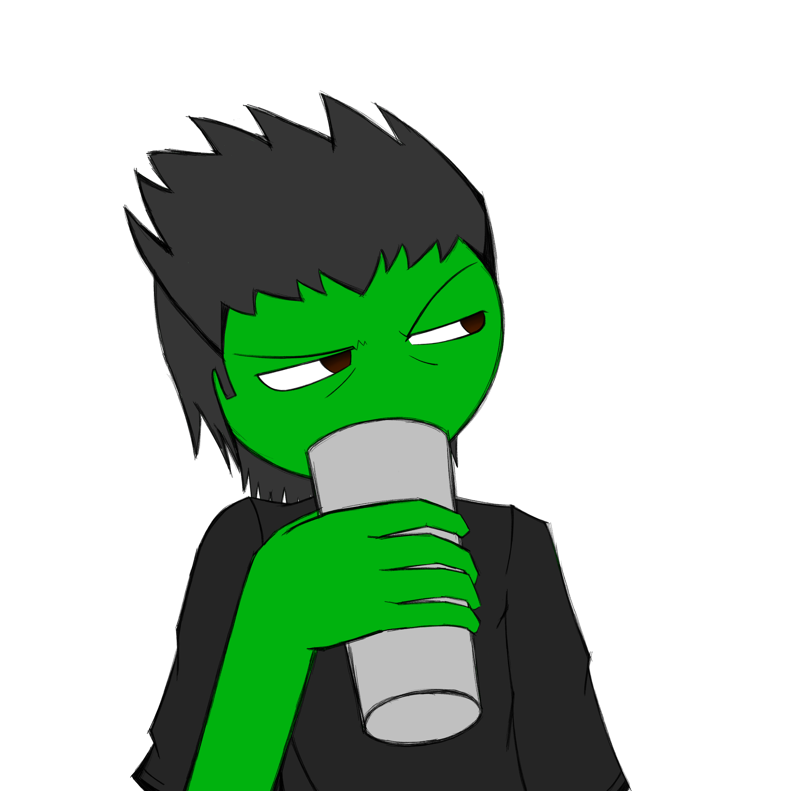
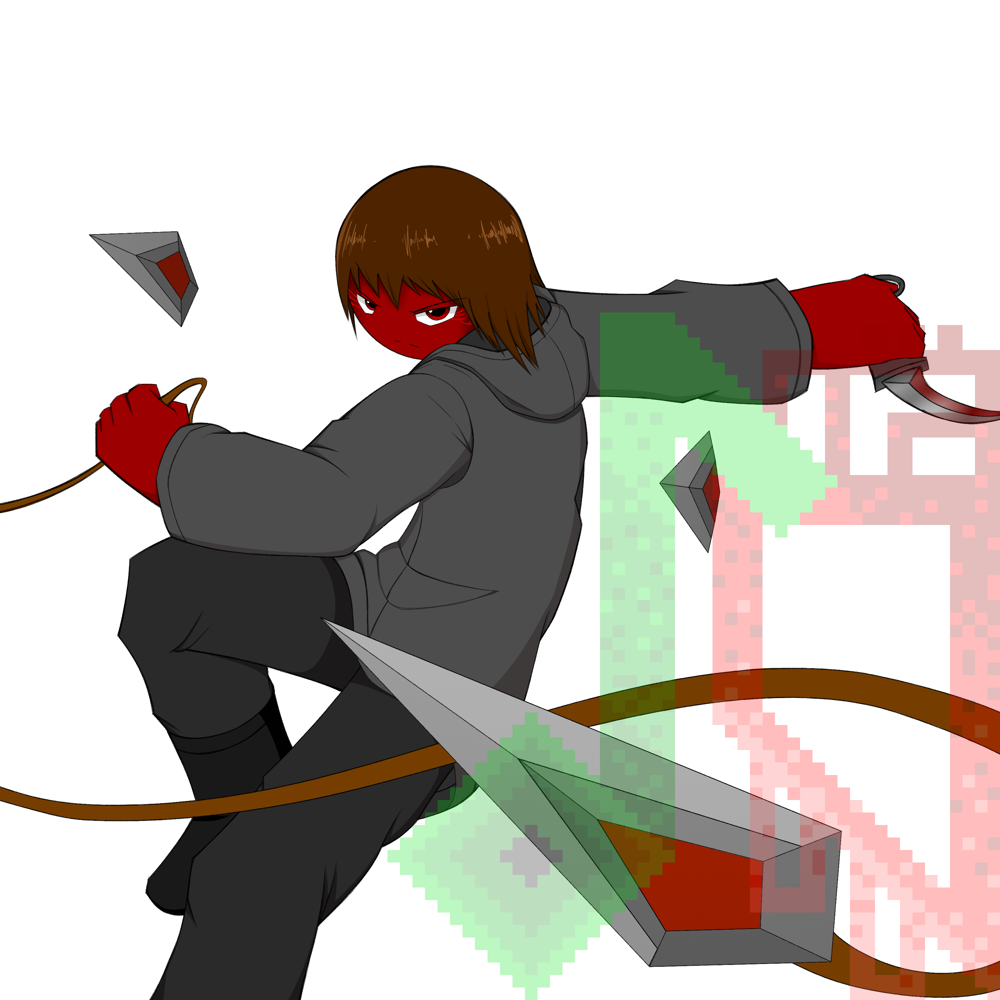
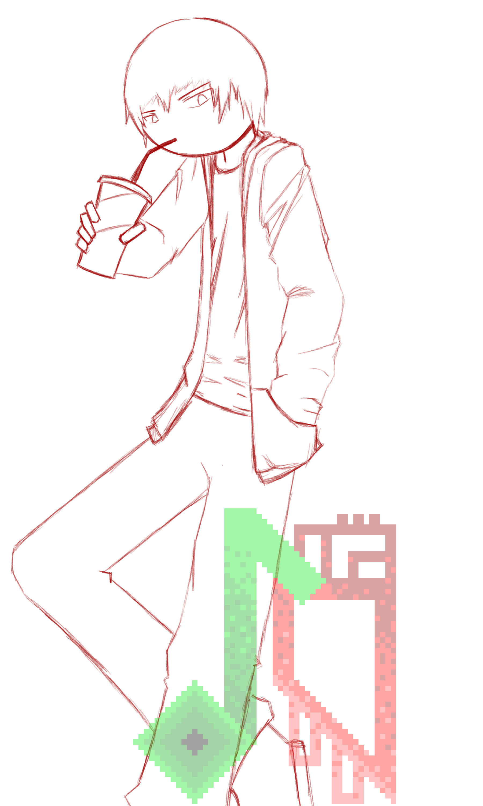
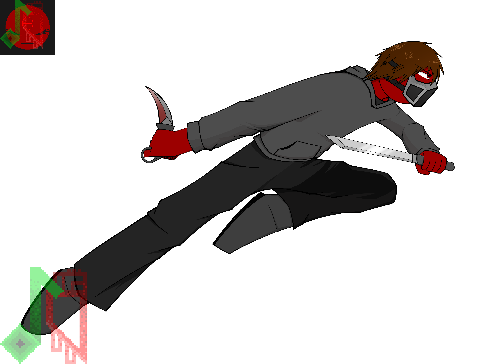

## "Anything Goes."

I don't know, consider this place as my art repository (I am not a professional artist, and I am not taking commissions at the moment, unless you actually want to commission me for something.)

Aran Ward - An original character I constantly drew over and over again until I started getting consistent with his design.

And yes, his render is based off of a render of Link during his time in Hyrule Warriors, go figure.

